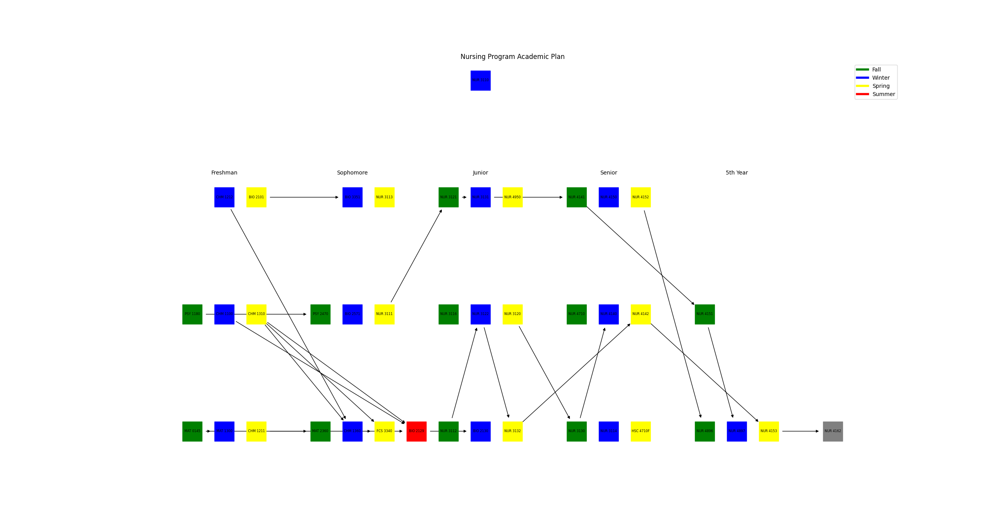

# Creating a Flowchart from a Dependency List
A work by: Tu H Vo and John Carlo Cabanilla

This project is designed to help students visualize the flow of courses required to complete two majors, Nursing and Information System. The program reads course information from two text files, major1.txt, and major2.txt, and visually represents the course dependencies. It also allows users to input their desired maximum number of credits per quarter and starting quarter, providing an outline of how to take the courses under these constraints.

## Description
This Python program reads course information from major1.txt and major2.txt, which contain the courses and constraints for the [Nursing](https://spu.edu/catalog/undergraduate/20212/degree-requirements?Area=MAJNURSE&Major=1NUR&navRoot={99458432-8EBA-4686-A8A6-53694E7C6F72}) and [Information System](https://spu.edu/catalog/undergraduate/20212/degree-requirements?Area=MAJCSIS&Major=1ISB&navRoot={E9BA8C13-F004-477B-984F-A0A2B3CF1E81}) majors, respectively. The program validates the input format and generates a graph visualization of the course dependencies using NetworkX and Matplotlib libraries. It then prompts the user for their maximum number of credits per quarter and starting quarter. The program provides an outline of how to take the courses with:
1. No constraints,
2. Constraints by the number of credits and offered quarter, and 
3. Graph visualizations with animation.

## Requirements
The program requires Python 3.1 or later and the following libraries:

- NetworkX: A Python library for the creation, manipulation, and study of complex networks. More information can be found in the [NetworkX documentation](https://networkx.org/documentation/stable/).
- Matplotlib: A plotting library for Python that produces high-quality visualizations, including graph visualizations. More information can be found in the [Matplotlib documentation](https://matplotlib.org/stable/contents.html).
To install these libraries, you can use pip:

```python
python3 -m pip install networkx matplotlib 
```

## User Manual

### Preparing the text file
The program follows a strict file format and if there is any typographical error in the file it will end the program and ask the user to review the input file and run the program again. Before using the file make sure the file that will be use is correctly formatted to prevent the error. <br/>

&nbsp; Here is the guide on how to create the file.<br/>
&nbsp;&nbsp;  1. Each line corresponds to a course and its attributes and this will be separate a comma (,) delimiter.<br/>
&nbsp;&nbsp;  2. There should be no space before or after the delimiter otherwise it will return an error.<br/>

#### Breakdown of each attribute in a file
&nbsp;&nbsp;  1. Course code<br/>
&nbsp;&nbsp;  2. Course name<br/>
&nbsp;&nbsp;  3. Course Credit<br/>
&nbsp;&nbsp;  4. Course prerequisites<br/>
&nbsp;&nbsp;  5. Course Availability (1, 2, 3, 4 corresponds to Fall, Winter, Spring, and Summer respectively)<br/>

### Installing the dependencies
Once the program is downloaded into the machine and the file is ready, there are different ways to run in depending on a workstation.
Here is the guide on how to run the program in different operating system.

#### Windows 10/11

Go to the file and of this project and make sure that all the dependecies are installed. If the dependecies are not installed we can try the following options to run it. <br/>

Option# 1 <br/>
Open a command prompt and run the following.

```cmd
C:\flowchar-ramen> python3 -m pip install virtualenv 
C:\flowchar-ramen> ./env\Scripts\activate.bat
(env) C:\flowchar-ramen> python3 -m pip install networkx matplotlib
```

Option# 2a <br/>
Open a command prompt and run the install.bat - This file a bat script that automate the installation of the dependecies needed for the program.

```cmd
C:\flowchar-ramen> install.bat
```
Option# 2b <br/>
Go to the file explorer and simple click the install.bat file and it will run the installation of the dependencies.


#### Mac/Linux

Go to the file and of this project and make sure that all the dependecies are installed. If the dependecies are not installed we can try the following options to run it. <br/>

Option# 1 <br/>
Open a termnial and run the following.

```cmd
@root\flowchar-ramen> python3 -m pip install virtualenv 
@root\flowchar-ramen> source env/Scripts/activate
(env) @root\flowchar-ramen> python3 -m pip install networkx matplotlib
```

Option# 2 <br/>
Open a command termnial and run the install.bat - This file a bat script that automate the installation of the dependecies needed for the program.

```cmd
@root\flowchar-ramen>sh install.sh
```

### Running the program

Once all the dependecies are installed, we can go ahead and run the program.


#### Windows 10/11

Option# 1 <br/>
Open a command prompt and run the following.

```cmd
C:\flowchar-ramen> ./env\Scripts\activate.bat
(env) C:\flowchar-ramen> python3 main.py
```

Option# 2a <br/>
Open a command prompt and run the install.bat - This file a bat script that automate the installation of the dependecies needed for the program.

```cmd
C:\flowchar-ramen> run.bat
```
Option# 2b <br/>
Go to the file explorer and simple click the run.bat file and it will run program.


#### Mac/Linux

Go to the file and of this project and make sure that all the dependecies are installed. If the dependecies are not installed we can try the following options to run it. <br/>

Option# 1 <br/>
Open a termnial and run the following.

```cmd
@root\flowchar-ramen> python3 -m pip install virtualenv 
@root\flowchar-ramen> source env/Scripts/activate
(env) @root\flowchar-ramen> python3 main.py
```

Option# 2 <br/>
Open a command termnial and run the run.sh - This file a script that automate execution of the program.

```cmd
@root\flowchar-ramen>sh run.sh
```

### Inside the program. 
Once you successfully run the program, there are some questions that needs to be filled up in order to generate the reprot that we need. Below is the sample questionaire that will show up in the screen. <br/>

```cmd
Please Enter the name of your program: IT  // Enter the name of the program ex.(IT, Nursing, Computer Science)
please enter your file name: major1.txt    // Enter the file name of the text file that we prepare that has all course description of the college program
Please select from the following
1 - Print course plan without constraint (15 credits starting fall quarter) 
2 - Print course plan with constraint (input the number of credits and start quarter)
3 - Print the Program workflow (Directed Graph Representaion)
enter your choice: 1                      // Select 1 2 or 3 for the option that you want to explore.
```

Note: for the second option the program will ask two more question to gather information about your starting quarter and number of credits that you want to take for each quarter.

### Demo
Here is the demo on how to run the program in Windows Operating System (Click on the thumbnail below).
[](https://www.youtube.com/watch?v=_16q0RhxFSE)


## Reflection
Our team of two decided to approach the project with the goal of creating a program that can visualize the courses required to complete two majors - Information Systems and Nursing. We first researched and experimented with different libraries on separate branches on GitHub. Each team member worked on implementing the functionality using their chosen library, and we compared the results to determine which libraries were most effective and flexible for users. For example, I first tested and chose Graphviz library to visualize since it produces high-quality graphs. However, it requires downloading a third-party application and sometimes is incompatible with the Window system. After choosing appropriate libraries, we discuss and implement functions separately; then, we merge implemented functions to have a working program. This collaborative approach allowed us to utilize our strengths and learn from one another since we communicated and read each other code over and over again to ensure consistency. Moreover, we have been working on our Capstone project for a while, so we can understand our programming and communication style leading to effective teamwork.

This is one of the most complicated that we have done. One of the main difficulties we encountered was parsing the text files and handling errors in the input format since the major requirement texts are complicated. Besides, this project required us to apply complex graph algorithms, which we only had a little practical experience with before taking this class. Implementing an effective algorithm to generate the graph takes us a while.

This could be a potential project that we can develop into a useful application for students. We would implement animation for options 1 and 2 - text representation of our program to improve the user experience. Also, we will improve User Interface to make the app looks better.

In conclusion, through this project, we gained valuable experience in working with third-party libraries, understanding the characteristics and algorithms of graphs, and applying our knowledge about graphs to solve a practical problem. Moreover, we have learned how to generate and visualize graphs using widely-used libraries: NetworkX and Matplotlib on Python. Overcoming these mentioned challenges we faced, we learned the importance of collaboration and effective problem-solving. This experience will be very beneficial for us in the future, and this is one of the most exciting experience that we have had.

